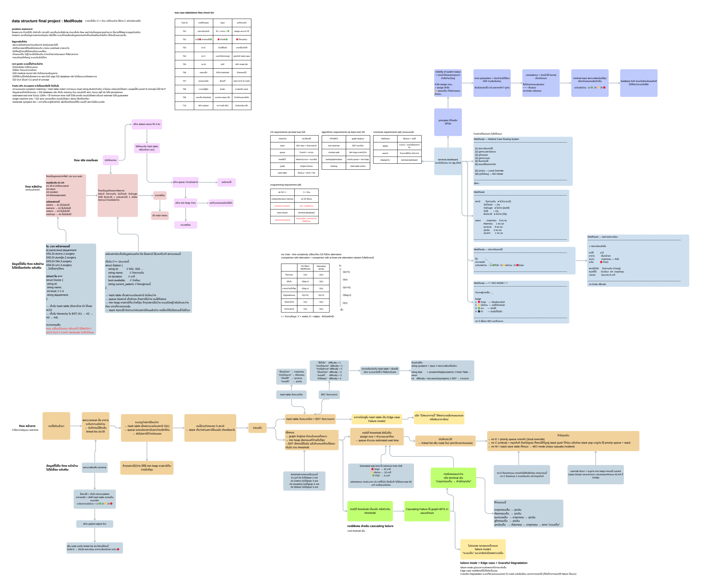

# 🏥 MedRoute: Hospital Queue & Routing Management System

**MedRoute** is an advanced smart hospital queueing, load-balancing, and patient routing system built in C++. Developed as a collaborative academic project for the **Data Structures & Algorithms** course, it demonstrates practical implementation of foundational computer science data structures to solve real-world hospital operational bottlenecks.

---

## 🗺️ System Design



Full design document: [docs/MedRoute_by_dnee2.pdf](docs/MedRoute_by_dnee2.pdf) · Test report (T01–T10): [docs/test_case_medroute.pdf](docs/test_case_medroute.pdf)

---

## 📁 Professional Repository Structure

To adhere to industry software engineering best practices, this repository is organized into standard directory structures:

```
MedRoute/
├── src/                          # Core source code
│   ├── main.cpp                  # Application entry point & menu loop
│   ├── doctor.h / .cpp           # Module 1: Doctor database & Min-Heap load balancing
│   ├── station.h / .cpp          # Module 2: Station routing & FIFO waiting queues
│   ├── patient.h / .cpp          # Module 3: Patient registration, BST mapping & history linked list
│   └── routing.h / .cpp          # Module 4: Graph BFS cascading failover & emergency priority queue
├── data/                         # Data layer
│   └── doctors.csv               # Master list of hospital doctors (loaded at startup)
├── docs/                         # Documentation
│   ├── MedRoute_by_dnee2.pdf     # Full design document
│   └── test_case_medroute.pdf    # Test report (T01–T10 with sample output)
├── tests/                        # Test inputs
│   └── test_t07.txt              # Stress-test input for the graceful-degradation case
├── .gitignore
└── README.md                     # Project overview (this file)

---

## 🚀 How to Compile & Run

Open your terminal, navigate to the root directory of this repository, and execute the following commands:

### 1. Compile the Project
Using `g++` with C++17 standards to output an executable named `MedRoute`:
```bash
g++ -std=c++17 src/*.cpp -o MedRoute
```

### 2. Run the Application
Execute the compiled binary from the root directory so it correctly locates `data/doctors.csv`:
```bash
./MedRoute
```

---

## 🛠️ Data Structures Implemented

- **Hash Tables (`unordered_map`)**: $O(1)$ constant time lookup for doctors, stations, and symptom-to-department routing.
- **Binary Search Trees (BST)**: $O(\log n)$ ordered storage for professional hierarchies and symptom difficulty rankings.
- **Min-Heap (`priority_queue`)**: Efficiently identifies the doctor with the lowest active workload to achieve load balancing.
- **Max-Heap Priority Queue**: Ensures incoming emergency override cases preempt standard queues.
- **Singly Linked List**: Dynamically appends patient event histories without arbitrary storage caps.
- **Stacks (`stack`)**: $O(1)$ LIFO operation used to track visited stations and preserve pre-emergency baseline configurations during critical interventions.
- **Graph BFS**: Discovers neighboring backup departments through iterative graph traversal to gracefully resolve departmental full-capacity blockades.

---

## ⚠️ Known Limitations & Future Improvements

Known trade-offs and planned improvements are tracked in the https://github.com/DneeInLalaland/MedRoute/issues tab:

- **Cascading failover graph excludes Obstetrics** — it is only reachable as a primary department, never as a BFS backup when others are full.
- **Doctor selection is O(n·log n), not O(log n)** — `findAvailableDoctor()` rebuilds its priority queue on every call instead of maintaining a persistent heap.
- **No explicit memory teardown on exit** — allocated objects are reclaimed by the OS instead of being freed via the existing `clearAll*()` routines.

---
*Developed with ❤️ for Advanced C++ Data Structures Engineering.*
